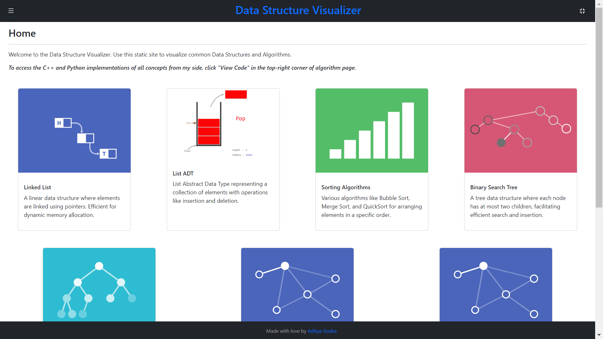
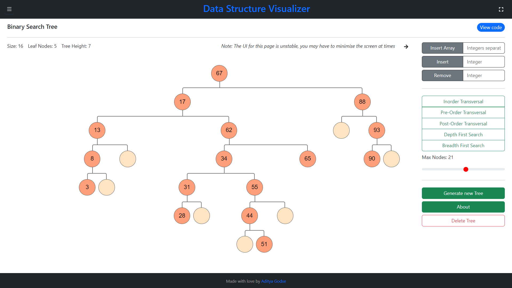

# Visual Data Structures (visual-code-studio)

visual-code-studio is a Data Structure Playground that you can use as a simulator to visualize various Data Structures and Algorithms. These include Linked lists, list ADTs (Stack, queue), Sorting Algorithms, Binary Search Trees, AVL trees, B+ trees, Pathfinding Algorithms, and Hashing Algorithms.

**Note:** This is not an implementation of the data structure itself in TypeScript; it is a visualization of how these data structures work.

This project is my attempt to learn TypeScript and the React framework for building interactive web applications.

Tools used in building this project include React as the frontend framework, Bootstrap for UI components (modals, tooltips, buttons, and icons), framer motion for animations, animejs, and immer.

Please excuse the poor structure of my code and components. I am a beginner who's learning-relearning-unlearning lot of things.

## Installation

**Required:** Node.js Version 18+

## Code Snippets

## How to Use This Site

1. **Linked list:** Perform CRUD operations on a linked list and reverse it.
2. **List ADT:** Visualize stacks and queues, and perform push-pop and enqueue-dequeue operations.
3. **Sorting:** Adjust bin size and animation speed to visualize sorting algorithms. Use keyboard keys to control animations (Space key to toggle play and pause, Arrow keys to skip steps). Supported algorithms include:
   - Selection Sort
   - Insertion Sort
   - Quick Sort
   - Merge Sort
   - Bubble Sort
4. **Binary Search Tree:** Perform CRUD operations, calculate size, leaf nodes, tree height, and get in-order, pre-order, post-order, depth-first, and breadth-first traversal. Insert multiple elements at once.
5. **AVL Tree:** Work in progress for balancing. Perform CRUD operations, but note that the tree is currently unbalanced.
6. **Dijkstra's Path Finding Algorithm:** Under development. Working on a draggable node and canvas.
7. **Inspiration:** Came across [visualgo](https://visualgo.net/en) and was inspired by their educational visualizations. Planning to visualize hashing algorithms for beginners.

## To-Do List

- AVL tree rotations
- Dijkstra's Algorithm Canvas component
- Hashing algorithm
- Implement "Insert after" function in linked list
- Implement Doubly and circular linked list
- Integrate the Howler library for adding sound effects in the sorting visualizer

## Contributing

Pull requests are welcome. For major changes, please open an issue first to discuss what you would like to change.

## License

[MIT](https://choosealicense.com/licenses/mit/)
